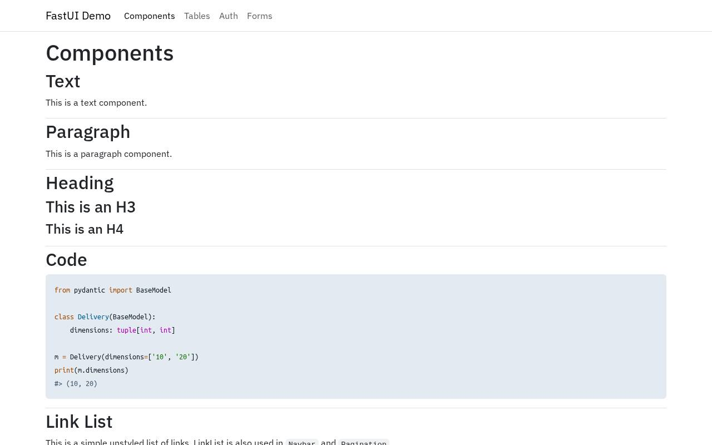
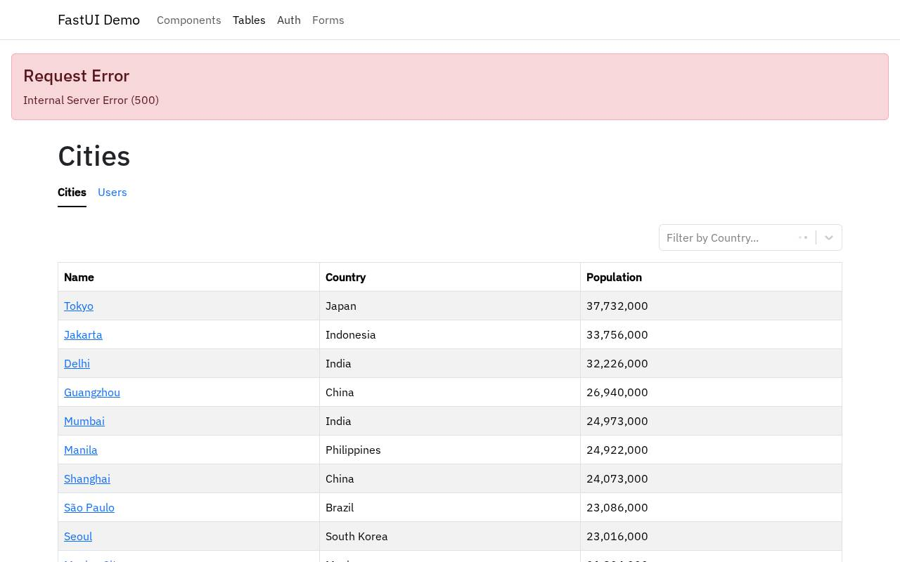
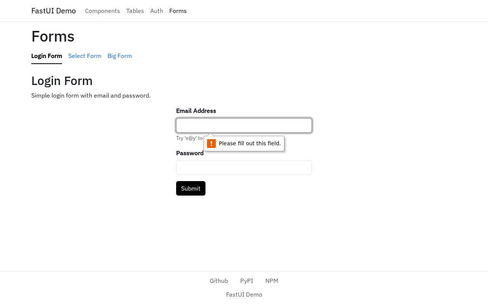

# QA intern report — https://github.com/pydantic/FastUI

**Verdict: FAIL** — 5 issue(s) (3 minor, 2 major)

| | |
|---|---|
| Target | https://github.com/pydantic/FastUI (built and served in a Solari sandbox) |
| Browser session | `ip-10-0-10-199:35e6ec28-b628-47e1-a6da-eb6eb1e162ce:cmtigtji301bqo101fik2drer:1788265451063.b-e2TyleS6KtiDIFBsLA-Q` |
| Replay | [replay.html](replay.html) — the events are saved next to this report |
| Film | [session.mp4](session.mp4) — one frame per action |
| Sandbox | `ZGVza3RvcC1wb29sLWktMGZkOWVkN2RjMDNhNzlkYjI6dm1fMDAxMTA0OmNtdGlndGppMzAxYnFvMTAxZmlrMmRyZXI6MTc4ODI2NTQ0MTc1Ng.42n195i_5q9OSv0nLSNc8Pb4jFPLxPcuBovkRp4cb1w` |
| Duration | 2m 50s |
| Actions | 30/30 across 40 model turns |
| Model | nvidia · openai/gpt-oss-120b |
| Tokens | in 682,313 · cache read 0 · cache write 0 · out 5,052 |

## Summary

The session ended without calling finish, after 30 of 30 actions.

Last words from the intern:

{
  "summary": "Exploratory testing of the FastUI demo uncovered multiple defects:\n\n1. **External video component fails to load** – Request to `https://www.w3schools.com/html/mov_bbb.mp4` aborts, so the video does not appear. (Minor)\n2. **Table filter and pagination cause 500 Internal Server Error** – Using the filter input or pagination links on the Cities table triggers a request to `/api/forms/search` that returns a 500 error, displaying an error page instead of updated data. (Major)\n3. **Auth login page returns 500 Internal Server Error** – Clicking the Auth link loads a page that immediately returns a 500 error, preventing any authentication flow. (Major)\n4. **Modal form submission provides no feedback** – Submitting the form inside the “Show Modal Form” modal closes the modal without any success indication or error message. (Minor)\n5. **Login form shows no validation feedback** – Submitting the login form with empty required fields results in no visible validation messages or error feedback. (Minor)\n6. **Select form page (linked from Users table) returns 500 Internal Server Error** – Navigating to the Users/Select form also triggers a 500 error, indicating a broader server-side issue. (Major)\n7. **External link to pydantic.dev blocked** – The request to `https://pydantic.dev/` is blocked by response policy, which is expected in the sandbox environment.\n\nAdditional observations:\n- The \"Load Content from Server\" and \"Load SSE content\" buttons display dynamic content as expected.\n- The \"Show Toast\" button correctly displays a toast.\n- Navigation links (home, components, tables, forms) load without errors when they do not involve server‑side searches.\n\nThe major defects (table navigation/filtering, authentication page, and select form) break core functionality, resulting in a failed assessment of the application.\n",
  "verdict": "fail"
}

## Issues

### 1. [minor] External video resource fails to load

*performance · confidence high · at https://369ca50d307e2121970a-3000.preview.getsolari.com/components*

Steps to reproduce:

1. Open the home page
2. Click on Components link

**Expected:** Video component loads and plays the example video

**Actual:** Request to https://www.w3schools.com/html/mov_bbb.mp4 fails (net::ERR_ABORTED), video does not load

Signals around this issue:

- request.failed: GET https://www.w3schools.com/html/mov_bbb.mp4 — net::ERR_ABORTED
- request.failed: GET https://www.w3schools.com/html/mov_bbb.mp4 — net::ERR_ABORTED
- request.failed: GET https://pydantic.dev/ — net::ERR_BLOCKED_BY_RESPONSE

### 2. [major] Table filter and pagination cause 500 Internal Server Error

*error · confidence high · at https://369ca50d307e2121970a-3000.preview.getsolari.com/auth/login/password*

Steps to reproduce:

1. Navigate to Tables > Cities
2. Click pagination link '2' or use filter input

**Expected:** Table updates to show next page or filtered results

**Actual:** Server returns 500 error, page shows 'Internal Server Error'

Signals around this issue:

- http.error: 500 GET https://369ca50d307e2121970a-3000.preview.getsolari.com/api/forms/search?q=
- http.error: 500 GET https://369ca50d307e2121970a-3000.preview.getsolari.com/api/forms/search?q=
- http.error: 500 GET https://369ca50d307e2121970a-3000.preview.getsolari.com/api/forms/search?q=
- http.error: 500 GET https://369ca50d307e2121970a-3000.preview.getsolari.com/api/forms/search?q=
- http.error: 500 GET https://369ca50d307e2121970a-3000.preview.getsolari.com/api/forms/search?q=

### 3. [major] Auth login page returns 500 Internal Server Error

*error · confidence high · at https://369ca50d307e2121970a-3000.preview.getsolari.com/auth/login/password*

Steps to reproduce:

1. Click Auth link in navbar

**Expected:** Login form is displayed

**Actual:** Server returns 500 error, page shows 'Internal Server Error'

Signals around this issue:

- http.error: 500 GET https://369ca50d307e2121970a-3000.preview.getsolari.com/api/forms/search?q=
- http.error: 500 GET https://369ca50d307e2121970a-3000.preview.getsolari.com/api/forms/search?q=
- http.error: 500 GET https://369ca50d307e2121970a-3000.preview.getsolari.com/api/forms/search?q=
- http.error: 500 GET https://369ca50d307e2121970a-3000.preview.getsolari.com/api/forms/search?q=
- http.error: 500 GET https://369ca50d307e2121970a-3000.preview.getsolari.com/api/forms/search?q=

### 4. [minor] Modal form submission provides no feedback

*usability · confidence high · at https://369ca50d307e2121970a-3000.preview.getsolari.com/auth/login/password*

Steps to reproduce:

1. Open Components page
2. Click Show Modal Form
3. Enter any text and click Submit

**Expected:** Form submission should show success message or close modal

**Actual:** Modal closes nothing changes, no indication of success

Signals around this issue:

- http.error: 500 GET https://369ca50d307e2121970a-3000.preview.getsolari.com/api/forms/search?q=
- http.error: 500 GET https://369ca50d307e2121970a-3000.preview.getsolari.com/api/forms/search?q=
- http.error: 500 GET https://369ca50d307e2121970a-3000.preview.getsolari.com/api/forms/search?q=
- http.error: 500 GET https://369ca50d307e2121970a-3000.preview.getsolari.com/api/forms/search?q=
- http.error: 500 GET https://369ca50d307e2121970a-3000.preview.getsolari.com/api/forms/search?q=

### 5. [minor] Login form does not display validation errors

*usability · confidence high · at https://369ca50d307e2121970a-3000.preview.getsolari.com/forms/login*

Steps to reproduce:

1. Navigate to Forms page
2. Click Submit without filling fields

**Expected:** Browser should show required field messages or server validation errors

**Actual:** No visible feedback; form appears unchanged

Signals around this issue:

- http.error: 500 GET https://369ca50d307e2121970a-3000.preview.getsolari.com/api/forms/search?q=
- request.failed: GET https://www.w3schools.com/html/mov_bbb.mp4 — net::ERR_ABORTED
- request.failed: GET https://www.w3schools.com/html/mov_bbb.mp4 — net::ERR_ABORTED
- request.failed: GET https://pydantic.dev/ — net::ERR_BLOCKED_BY_RESPONSE
- request.failed: GET https://369ca50d307e2121970a-3000.preview.getsolari.com/api/components/sse — net::ERR_ABORTED

## Machine-collected signals

| # | Kind | Page | Detail |
|---|---|---|---|
| 1 | request.failed | https://369ca50d307e2121970a-3000.preview.getsolari.com/components | GET https://www.w3schools.com/html/mov_bbb.mp4 — net::ERR_ABORTED |
| 2 | request.failed | https://369ca50d307e2121970a-3000.preview.getsolari.com/components | GET https://www.w3schools.com/html/mov_bbb.mp4 — net::ERR_ABORTED |
| 3 | request.failed | https://369ca50d307e2121970a-3000.preview.getsolari.com/components | GET https://pydantic.dev/ — net::ERR_BLOCKED_BY_RESPONSE |
| 4 | request.failed | https://369ca50d307e2121970a-3000.preview.getsolari.com/components | GET https://www.w3schools.com/html/mov_bbb.mp4 — net::ERR_ABORTED |
| 5 | http.error | https://369ca50d307e2121970a-3000.preview.getsolari.com/table/cities | 500 GET https://369ca50d307e2121970a-3000.preview.getsolari.com/api/forms/search?q= |
| 6 | http.error | https://369ca50d307e2121970a-3000.preview.getsolari.com/table/cities | 500 GET https://369ca50d307e2121970a-3000.preview.getsolari.com/api/forms/search?q= |
| 7 | http.error | https://369ca50d307e2121970a-3000.preview.getsolari.com/table/cities | 500 GET https://369ca50d307e2121970a-3000.preview.getsolari.com/api/forms/search?q= |
| 8 | http.error | https://369ca50d307e2121970a-3000.preview.getsolari.com/auth/login/password | 500 GET https://369ca50d307e2121970a-3000.preview.getsolari.com/api/forms/search?q= |
| 9 | http.error | https://369ca50d307e2121970a-3000.preview.getsolari.com/auth/login/password | 500 GET https://369ca50d307e2121970a-3000.preview.getsolari.com/api/forms/search?q= |
| 10 | http.error | https://369ca50d307e2121970a-3000.preview.getsolari.com/ | 500 GET https://369ca50d307e2121970a-3000.preview.getsolari.com/api/forms/search?q= |
| 11 | http.error | https://369ca50d307e2121970a-3000.preview.getsolari.com/ | 500 GET https://369ca50d307e2121970a-3000.preview.getsolari.com/api/forms/search?q= |
| 12 | request.failed | https://369ca50d307e2121970a-3000.preview.getsolari.com/components | GET https://www.w3schools.com/html/mov_bbb.mp4 — net::ERR_ABORTED |
| 13 | request.failed | https://369ca50d307e2121970a-3000.preview.getsolari.com/components | GET https://www.w3schools.com/html/mov_bbb.mp4 — net::ERR_ABORTED |
| 14 | request.failed | https://369ca50d307e2121970a-3000.preview.getsolari.com/components | GET https://pydantic.dev/ — net::ERR_BLOCKED_BY_RESPONSE |
| 15 | request.failed | https://369ca50d307e2121970a-3000.preview.getsolari.com/forms/login | GET https://369ca50d307e2121970a-3000.preview.getsolari.com/api/components/sse — net::ERR_ABORTED |
| 16 | http.error | https://369ca50d307e2121970a-3000.preview.getsolari.com/forms/select | 500 GET https://369ca50d307e2121970a-3000.preview.getsolari.com/api/forms/search?q= |
| 17 | http.error | https://369ca50d307e2121970a-3000.preview.getsolari.com/forms/select | 500 GET https://369ca50d307e2121970a-3000.preview.getsolari.com/api/forms/search?q= |
| 18 | request.failed | https://369ca50d307e2121970a-3000.preview.getsolari.com/forms/select | GET https://www.w3schools.com/html/mov_bbb.mp4 — net::ERR_ABORTED |
| 19 | request.failed | https://369ca50d307e2121970a-3000.preview.getsolari.com/forms/select | GET https://pydantic.dev/ — net::ERR_BLOCKED_BY_RESPONSE |

## Pages visited

- https://369ca50d307e2121970a-3000.preview.getsolari.com/
- https://369ca50d307e2121970a-3000.preview.getsolari.com/components
- https://369ca50d307e2121970a-3000.preview.getsolari.com/table/cities
- https://369ca50d307e2121970a-3000.preview.getsolari.com/auth/login/password
- https://369ca50d307e2121970a-3000.preview.getsolari.com/forms/login
- https://369ca50d307e2121970a-3000.preview.getsolari.com/forms/select
