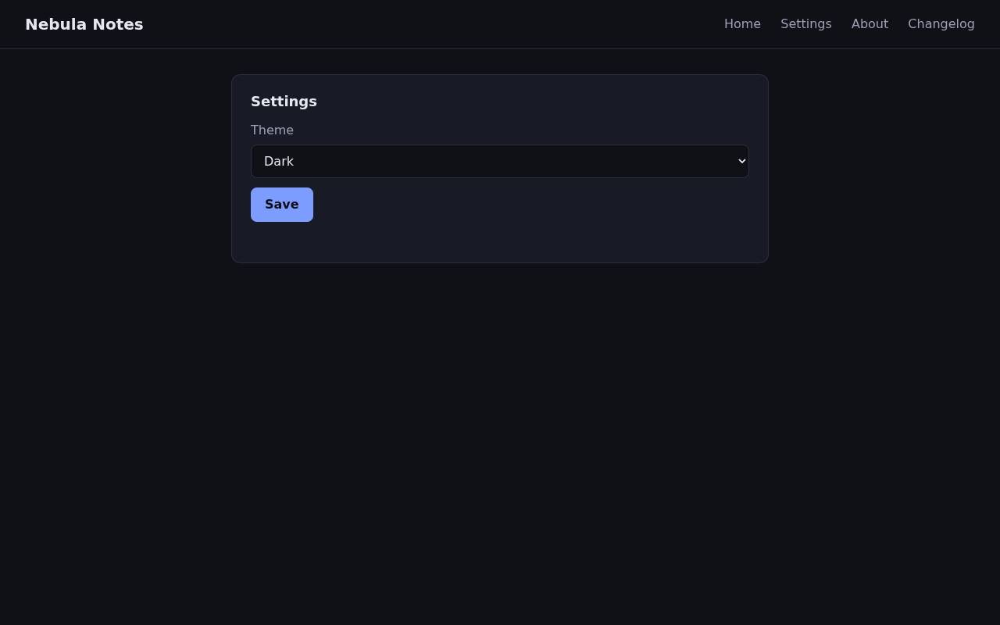
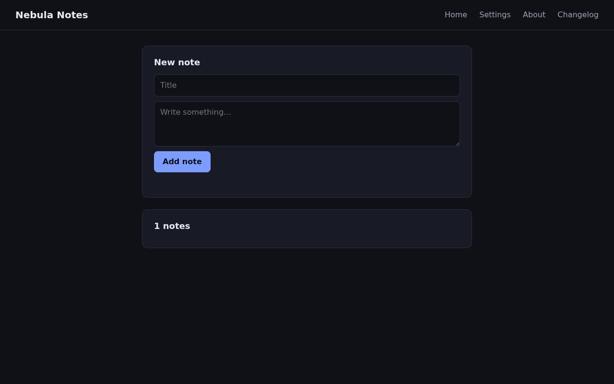

# QA intern report — https://github.com/KeiaiLab-PHIL/solari-cookbook (examples/qa-intern-ts/demo-app)

**Verdict: FAIL** — 7 issue(s) (5 major, 2 minor)

| | |
|---|---|
| Target | https://github.com/KeiaiLab-PHIL/solari-cookbook (examples/qa-intern-ts/demo-app) (built and served in a Solari sandbox) |
| Browser session | `ip-10-0-11-12:1d01ed98-6033-4a76-8c91-3888a166104d:cmtigtji301bqo101fik2drer:1788261673115.X-YQ_FAFaTbA-Mhv6yr4hw` |
| Replay | not available |
| Sandbox | `ZGVza3RvcC1wb29sLWktMGZkOWVkN2RjMDNhNzlkYjI6dm1fMDAwOTkzOmNtdGlndGppMzAxYnFvMTAxZmlrMmRyZXI6MTc4ODI2MTY2OTgzNw.DZGZXbobIW7Ue8RNo5cl7ZIjxrMja2-hdIzKXcmzSGw` |
| Duration | 1m 59s |
| Actions | 30/30 across 44 model turns |
| Model | nvidia · openai/gpt-oss-120b |
| Tokens | in 454,744 · cache read 0 · cache write 0 · out 5,896 |

## Summary

Found multiple defects: broken Changelog link (404), server errors on empty note (400) and Unicode note (500), JavaScript error on Settings page, notes count mismatch, Delete button overflow with long titles, pluralization error for single note count. All major issues verified through UI interactions and server logs.

## Issues

### 1. [major] Changelog page returns 404

*functional · confidence high · at https://2143662b472728297bc0-3000.preview.getsolari.com*

Steps to reproduce:

1. Open the main page
2. Click the 'Changelog' link in the navigation

**Expected:** Changelog page loads successfully

**Actual:** Clicking 'Changelog' results in a 404 Not Found error

### 2. [major] Adding note with empty title and content triggers server 400 error

*error · confidence high · at https://2143662b472728297bc0-3000.preview.getsolari.com*

Steps to reproduce:

1. Leave title and content empty
2. Click 'Add note'

**Expected:** Client-side validation prevents submission or user-friendly error message

**Actual:** Server returns 400 error

Signals around this issue:

- http.error: 400 POST https://2143662b472728297bc0-3000.preview.getsolari.com/api/notes

### 3. [major] Adding note with Unicode characters causes 500 server error

*error · confidence high · at https://2143662b472728297bc0-3000.preview.getsolari.com*

Steps to reproduce:

1. Enter Unicode characters in title and content
2. Click Add note

**Expected:** Note is saved successfully

**Actual:** Server returns 500 error

Signals around this issue:

- http.error: 400 POST https://2143662b472728297bc0-3000.preview.getsolari.com/api/notes
- http.error: 500 POST https://2143662b472728297bc0-3000.preview.getsolari.com/api/notes

### 4. [major] JavaScript error on Settings page

*error · confidence high · at https://2143662b472728297bc0-3000.preview.getsolari.com/settings*

Steps to reproduce:

1. Navigate to Settings via the navigation link

**Expected:** Settings page loads without errors

**Actual:** Uncaught TypeError on page load

Signals around this issue:

- http.error: 400 POST https://2143662b472728297bc0-3000.preview.getsolari.com/api/notes
- http.error: 500 POST https://2143662b472728297bc0-3000.preview.getsolari.com/api/notes
- page.error: Uncaught TypeError: Cannot set properties of null (setting 'value') (https://2143662b472728297bc0-3000.preview.getsolari.com/settings:33)

### 5. [major] Notes count displayed does not match actual note entries

*data · confidence high · at https://2143662b472728297bc0-3000.preview.getsolari.com/settings*

Steps to reproduce:

1. Add notes
2. Observe the notes count header vs displayed notes

**Expected:** Number of notes header matches the number of displayed note entries

**Actual:** Header shows 3 notes but only two note entries are displayed

Signals around this issue:

- http.error: 400 POST https://2143662b472728297bc0-3000.preview.getsolari.com/api/notes
- http.error: 500 POST https://2143662b472728297bc0-3000.preview.getsolari.com/api/notes
- page.error: Uncaught TypeError: Cannot set properties of null (setting 'value') (https://2143662b472728297bc0-3000.preview.getsolari.com/settings:33)
- page.error: Uncaught TypeError: Cannot set properties of null (setting 'value') (https://2143662b472728297bc0-3000.preview.getsolari.com/settings:33)

### 6. [minor] Delete button label overflows with long note titles

*visual · confidence high · at https://2143662b472728297bc0-3000.preview.getsolari.com/settings*

Steps to reproduce:

1. Add a note with a very long title
2. Observe the Delete button text

**Expected:** Delete button shows concise label or truncates

**Actual:** Delete button displays the entire long title causing layout overflow

Signals around this issue:

- http.error: 400 POST https://2143662b472728297bc0-3000.preview.getsolari.com/api/notes
- http.error: 500 POST https://2143662b472728297bc0-3000.preview.getsolari.com/api/notes
- page.error: Uncaught TypeError: Cannot set properties of null (setting 'value') (https://2143662b472728297bc0-3000.preview.getsolari.com/settings:33)
- page.error: Uncaught TypeError: Cannot set properties of null (setting 'value') (https://2143662b472728297bc0-3000.preview.getsolari.com/settings:33)

### 7. [minor] Notes count label uses plural 'notes' even for a single note

*content · confidence high · at https://2143662b472728297bc0-3000.preview.getsolari.com*

Steps to reproduce:

1. Add a single note
2. Observe the notes count label

**Expected:** Displays '1 note' when there is only one note

**Actual:** Displays '1 notes'

Signals around this issue:

- http.error: 400 POST https://2143662b472728297bc0-3000.preview.getsolari.com/api/notes
- http.error: 500 POST https://2143662b472728297bc0-3000.preview.getsolari.com/api/notes
- page.error: Uncaught TypeError: Cannot set properties of null (setting 'value') (https://2143662b472728297bc0-3000.preview.getsolari.com/settings:33)
- page.error: Uncaught TypeError: Cannot set properties of null (setting 'value') (https://2143662b472728297bc0-3000.preview.getsolari.com/settings:33)

## Machine-collected signals

| # | Kind | Page | Detail |
|---|---|---|---|
| 1 | http.error | https://2143662b472728297bc0-3000.preview.getsolari.com/ | 400 POST https://2143662b472728297bc0-3000.preview.getsolari.com/api/notes |
| 2 | http.error | https://2143662b472728297bc0-3000.preview.getsolari.com/ | 500 POST https://2143662b472728297bc0-3000.preview.getsolari.com/api/notes |
| 3 | page.error | https://2143662b472728297bc0-3000.preview.getsolari.com/settings | Uncaught TypeError: Cannot set properties of null (setting 'value') (https://2143662b472728297bc0-3000.preview.getsolari.com/settings:33) |
| 4 | page.error | https://2143662b472728297bc0-3000.preview.getsolari.com/settings | Uncaught TypeError: Cannot set properties of null (setting 'value') (https://2143662b472728297bc0-3000.preview.getsolari.com/settings:33) |

## Pages visited

- about:blank
- https://2143662b472728297bc0-3000.preview.getsolari.com/
- https://2143662b472728297bc0-3000.preview.getsolari.com/settings
- https://2143662b472728297bc0-3000.preview.getsolari.com/
- https://2143662b472728297bc0-3000.preview.getsolari.com/about
