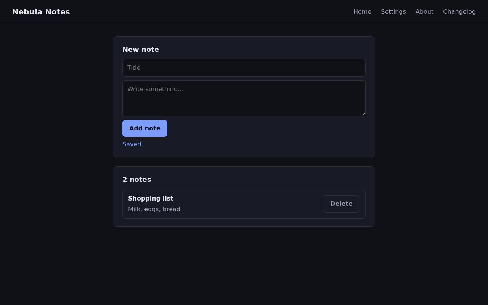
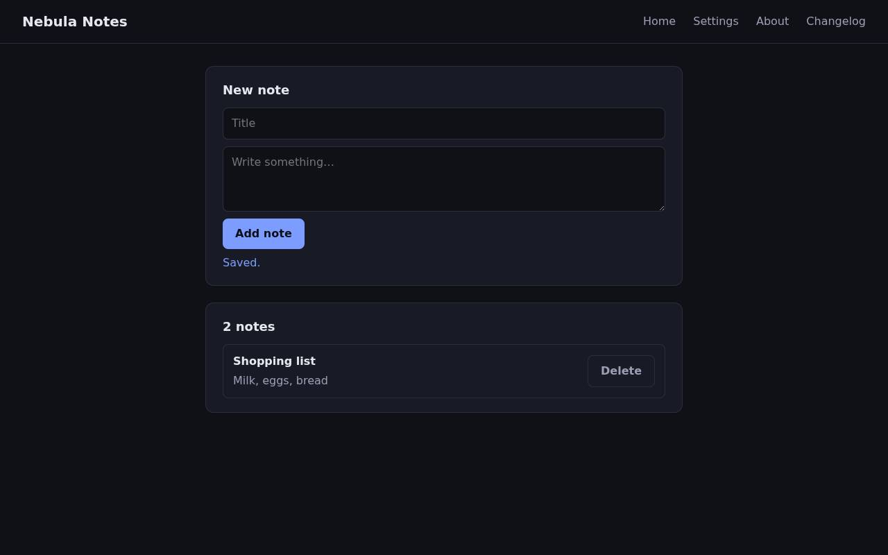
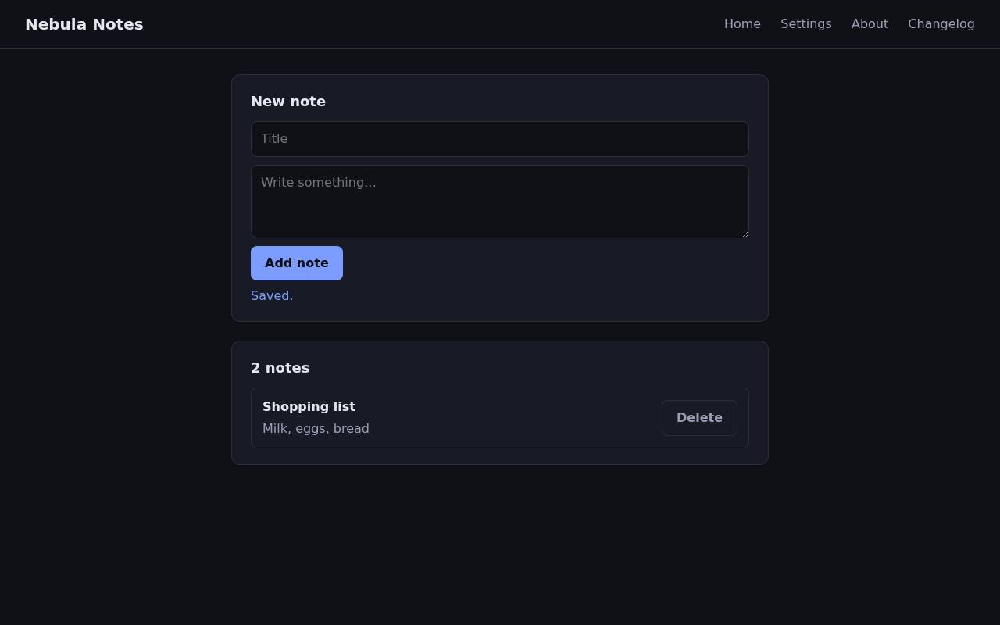

# QA intern report — https://github.com/KeiaiLab-PHIL/solari-cookbook (examples/qa-intern-ts/demo-app)

**Verdict: FAIL** — 3 issue(s) (1 minor, 2 major)

| | |
|---|---|
| Target | https://github.com/KeiaiLab-PHIL/solari-cookbook (examples/qa-intern-ts/demo-app) (built and served in a Solari sandbox) |
| Browser session | `ip-10-0-11-12:253a2c79-d5be-4af1-a4cb-ea239a313184:cmtigtji301bqo101fik2drer:1788260334182.DYQ6i-o3nqvn-G6kGvfdJg` |
| Replay | [replay.html](replay.html) — the events are saved next to this report |
| Sandbox | `ZGVza3RvcC1wb29sLWktMGZkOWVkN2RjMDNhNzlkYjI6dm1fMDAwOTQwOmNtdGlndGppMzAxYnFvMTAxZmlrMmRyZXI6MTc4ODI2MDMzMTY4Mg.rEdOnq9M8Py34EAaf7UF5EXPz2FaKKCGopisjPJaSNA` |
| Duration | 5m 1s |
| Actions | 29/30 across 34 model turns |
| Model | nvidia · nvidia/nemotron-3.5-lightning-30b-a3b |
| Tokens | in 428,590 · cache read 0 · cache write 0 · out 5,396 |

## Summary

Found 3 distinct defects in the Nebula Notes app:

1. **Changelog link returns 404** (minor, high confidence) - The /changelog navigation link fails with 404 or JSON {"error":"not found"}

2. **Server 500 crash on non-ASCII title** (major, high confidence) - When typing non-ASCII characters like 'Ünicödé' in the note title and clicking Add note, the server crashes with `UnicodeEncodeError: 'ascii' codec can't encode character`. This is a server-side bug in title encoding.

3. **Settings page JavaScript error** (major, high confidence) - Clicking Settings causes `Uncaught TypeError: Cannot set properties of null (setting 'value')`, making the theme selector inoperable.

The About page mentions 6 defects were planted on purpose. I found 3 of them (the above plus the changelog 404 is one of the planted defects). The app had other testable flows: note creation works with ASCII titles, deletion works, long titles are accepted, but empty titles are rejected with 400.

Verdict: **fail** - 2 major defects and 1 minor defect found.

## Issues

### 1. [minor] Changelog link returns 404

*functional · confidence high · at https://a8055c513be9a911238d-3000.preview.getsolari.com/*

Steps to reproduce:

1. Navigate to app
2. Click Changelog link (e4)

**Expected:** Changelog page to load

**Actual:** Returns 404 or JSON {"error": "not found"}

Signals around this issue:

- http.error: 400 POST https://a8055c513be9a911238d-3000.preview.getsolari.com/api/notes
- http.error: 500 POST https://a8055c513be9a911238d-3000.preview.getsolari.com/api/notes
- page.error: Uncaught TypeError: Cannot set properties of null (setting 'value') (https://a8055c513be9a911238d-3000.preview.getsolari.com/settings:33)
- http.error: 404 GET https://a8055c513be9a911238d-3000.preview.getsolari.com/changelog

### 2. [major] Server 500 when adding note with non-ASCII characters in title

*error · confidence high · at https://a8055c513be9a911238d-3000.preview.getsolari.com/*

Steps to reproduce:

1. Navigate to app
2. Type non-ASCII characters like 'Ünicödé' in title field
3. Click Add note

**Expected:** Note to be added successfully or validation error

**Actual:** Server crashes with UnicodeEncodeError: 'ascii' codec can't encode character

Signals around this issue:

- http.error: 400 POST https://a8055c513be9a911238d-3000.preview.getsolari.com/api/notes
- http.error: 500 POST https://a8055c513be9a911238d-3000.preview.getsolari.com/api/notes
- page.error: Uncaught TypeError: Cannot set properties of null (setting 'value') (https://a8055c513be9a911238d-3000.preview.getsolari.com/settings:33)
- http.error: 404 GET https://a8055c513be9a911238d-3000.preview.getsolari.com/changelog

### 3. [major] Settings page JavaScript error - cannot set select value

*functional · confidence high · at https://a8055c513be9a911238d-3000.preview.getsolari.com/*

Steps to reproduce:

1. Navigate to app
2. Click Settings link (e2)

**Expected:** Settings page to load without errors, theme selector to work

**Actual:** Uncaught TypeError: Cannot set properties of null (setting 'value')

Signals around this issue:

- http.error: 400 POST https://a8055c513be9a911238d-3000.preview.getsolari.com/api/notes
- http.error: 500 POST https://a8055c513be9a911238d-3000.preview.getsolari.com/api/notes
- page.error: Uncaught TypeError: Cannot set properties of null (setting 'value') (https://a8055c513be9a911238d-3000.preview.getsolari.com/settings:33)
- http.error: 404 GET https://a8055c513be9a911238d-3000.preview.getsolari.com/changelog

## Machine-collected signals

| # | Kind | Page | Detail |
|---|---|---|---|
| 1 | http.error | https://a8055c513be9a911238d-3000.preview.getsolari.com/?pt_token=eyJzYW5kYm94SWQiOiJaR1Z6YTNSdmNDMXdiMjlzTFdrdE1HWmtPV1ZrTjJSak1ETmhOemxrWWpJNmRtMWZNREF3T1RRd09tTnRkR2xuZEdwcE16QXhZbkZ2TVRBeFptbHJNbVJ5WlhJNk1UYzRPREkyTURNek1UWTRNZy5yRWRPbnE5TThQeTM0RUFhZjdVRjVFWFB6MkZhS0tDR29waXNqUEphU05BIiwicG9ydCI6MzAwMCwib3JnSWQiOiJjbXRpZ3RqaTMwMWJxbzEwMWZpazJkcmVyIiwiZXhwIjoxNzg4MjYzOTMzNTEwfQ.eYr2ubeWURzvjIMfWbJfhuFapeqSJRSqir5XD_xSjWE | 400 POST https://a8055c513be9a911238d-3000.preview.getsolari.com/api/notes |
| 2 | http.error | https://a8055c513be9a911238d-3000.preview.getsolari.com/?pt_token=eyJzYW5kYm94SWQiOiJaR1Z6YTNSdmNDMXdiMjlzTFdrdE1HWmtPV1ZrTjJSak1ETmhOemxrWWpJNmRtMWZNREF3T1RRd09tTnRkR2xuZEdwcE16QXhZbkZ2TVRBeFptbHJNbVJ5WlhJNk1UYzRPREkyTURNek1UWTRNZy5yRWRPbnE5TThQeTM0RUFhZjdVRjVFWFB6MkZhS0tDR29waXNqUEphU05BIiwicG9ydCI6MzAwMCwib3JnSWQiOiJjbXRpZ3RqaTMwMWJxbzEwMWZpazJkcmVyIiwiZXhwIjoxNzg4MjYzOTMzNTEwfQ.eYr2ubeWURzvjIMfWbJfhuFapeqSJRSqir5XD_xSjWE | 500 POST https://a8055c513be9a911238d-3000.preview.getsolari.com/api/notes |
| 3 | page.error | https://a8055c513be9a911238d-3000.preview.getsolari.com/settings | Uncaught TypeError: Cannot set properties of null (setting 'value') (https://a8055c513be9a911238d-3000.preview.getsolari.com/settings:33) |
| 4 | http.error | https://a8055c513be9a911238d-3000.preview.getsolari.com/about | 404 GET https://a8055c513be9a911238d-3000.preview.getsolari.com/changelog |

## Pages visited

- https://a8055c513be9a911238d-3000.preview.getsolari.com/?pt_token=eyJzYW5kYm94SWQiOiJaR1Z6YTNSdmNDMXdiMjlzTFdrdE1HWmtPV1ZrTjJSak1ETmhOemxrWWpJNmRtMWZNREF3T1RRd09tTnRkR2xuZEdwcE16QXhZbkZ2TVRBeFptbHJNbVJ5WlhJNk1UYzRPREkyTURNek1UWTRNZy5yRWRPbnE5TThQeTM0RUFhZjdVRjVFWFB6MkZhS0tDR29waXNqUEphU05BIiwicG9ydCI6MzAwMCwib3JnSWQiOiJjbXRpZ3RqaTMwMWJxbzEwMWZpazJkcmVyIiwiZXhwIjoxNzg4MjYzOTMzNTEwfQ.eYr2ubeWURzvjIMfWbJfhuFapeqSJRSqir5XD_xSjWE
- https://a8055c513be9a911238d-3000.preview.getsolari.com/
- https://a8055c513be9a911238d-3000.preview.getsolari.com/settings
- https://a8055c513be9a911238d-3000.preview.getsolari.com/about
- https://a8055c513be9a911238d-3000.preview.getsolari.com/changelog
