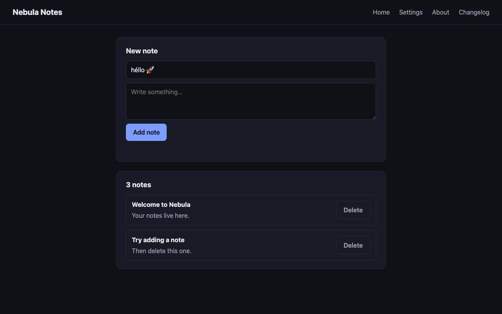
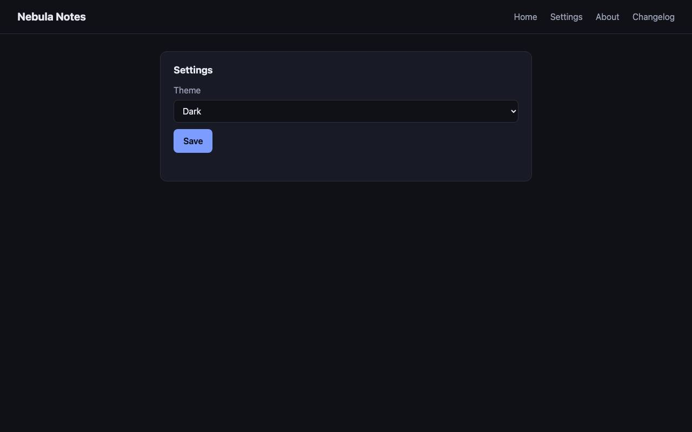

# QA intern report — http://127.0.0.1:8765

**Verdict: FAIL** — 2 issue(s) (1 critical, 1 major)

| | |
|---|---|
| Target | http://127.0.0.1:8765 (live URL) |
| Browser session | `scripted-local` |
| Replay | not available |
| Duration | 4s |
| Actions | 7/12 across 0 model turns |
| Model | scripted (no model), effort n/a |
| Tokens | in 0 · cache read 0 · cache write 0 · out 0 |

## Summary

Scripted sample: two defects reproduced.

## Issues

### 1. [critical] Non-ASCII note title fails with HTTP 500 and no feedback

*error · confidence high · at http://127.0.0.1:8765/*

Steps to reproduce:

1. Type "héllo 🚀" in Title
2. Click Add note

**Expected:** The note is saved, or a validation message explains what is wrong

**Actual:** POST /api/notes returns 500 (UnicodeEncodeError in the server log); the form stays as it was

Signals around this issue:

- http.error: 500 POST http://127.0.0.1:8765/api/notes

### 2. [major] Settings page throws on load; Save does nothing

*error · confidence high · at http://127.0.0.1:8765/settings*

Steps to reproduce:

1. Open /settings
2. Pick a theme
3. Click Save

**Expected:** The theme is saved and a confirmation appears

**Actual:** TypeError on load (element #theme-select missing); Save has no effect

Signals around this issue:

- http.error: 500 POST http://127.0.0.1:8765/api/notes
- page.error: Uncaught TypeError: Cannot set properties of null (setting 'value') (http://127.0.0.1:8765/settings:33)

## Machine-collected signals

| # | Kind | Page | Detail |
|---|---|---|---|
| 1 | http.error | http://127.0.0.1:8765/ | 500 POST http://127.0.0.1:8765/api/notes |
| 2 | page.error | http://127.0.0.1:8765/settings | Uncaught TypeError: Cannot set properties of null (setting 'value') (http://127.0.0.1:8765/settings:33) |

## Pages visited

- http://127.0.0.1:8765/
- http://127.0.0.1:8765/settings
